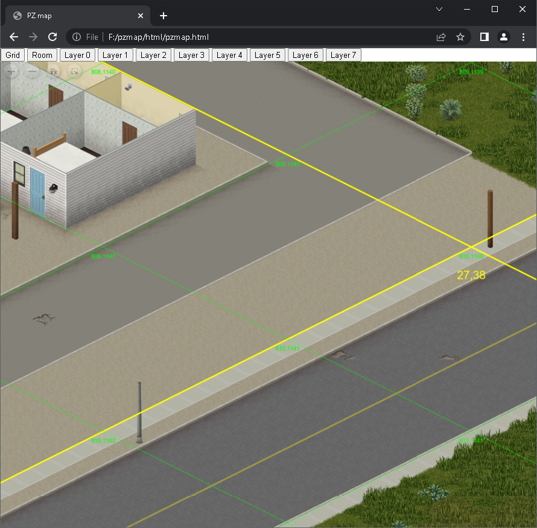
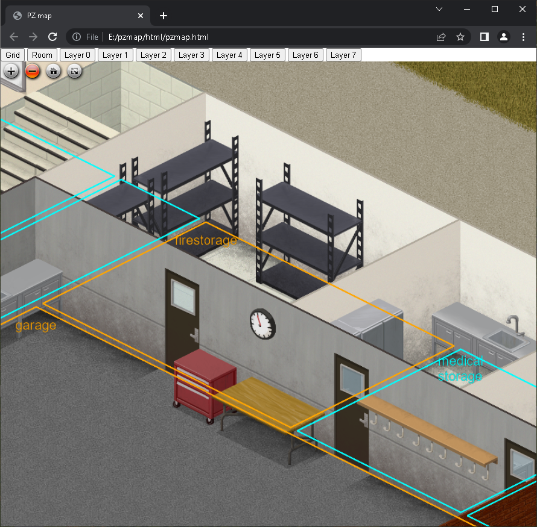

# pzmap2dzi
pzmap2dzi is a command-line tool running on Windows to convert Project Zomboid map data into [Deep Zoom format](https://en.wikipedia.org/wiki/Deep_Zoom).

# Features

- Supports python 3
- HTML viewer for viewing the generated Deep Zoom image.
- Various plant rendering configurations (snow, flower, tree size, etc.).
- Supports multi-thread acceleration
- Supports resuming from a breakpoint
- Supports map grid and room info rendering
- Supports game version 41.68

# Requirement
- The full output size for game version 41.68 is around 1.1TB and consists of 1.3M files. Make sure your output to a hard drive has enough free space.
- The rendering process will take a very long time, so it's better to have a high-performance CPU, hard drive, and large memory. 
    - (The rendering took around 18 hours on an AMD 3700X with 64GB DDR4 2133 memory and a SATA3 mechanical hard drive using a 16 thread setting)

# How to run

1. Install python
2. Clone or download the project
3. Check the script and adapt to your needs

    `run.sh`

- Change `-m 16` to `-m 4` to use only four threads.
- Remove the calls to render\_grid and render\_room to not render grid and room info.

# How to start the HTML viewer
After the rendering, you get an `html` folder in your output path.
html
├── base/
├── grid/
├── openseadragon/
├── room/
├─ chrome\_allow\_file(need close chrome first).bat
├─ chrome\_no\_sicurity.bat
├─ pzmap.html
└─ run\_server.bat
```

Directly open `pzmap.html` will NOT work, as the Cross-Origin Resource Sharing (CORS) Policies will refuse to load Deep Zoom tiles from your locale disk by default.

# How to use the HTML viewer
- To switch floors, use the button form `Layer0` to `Layer7` on top of the page
- To enable/disable the grid, use the `Grid` button
    
- To enable/disable room info, use the `Room` button
    
